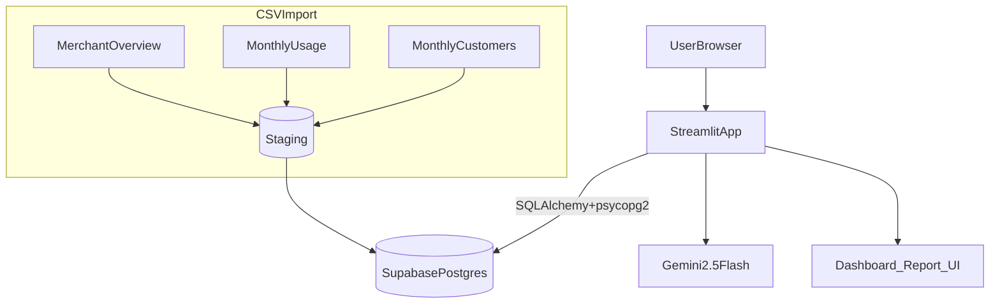
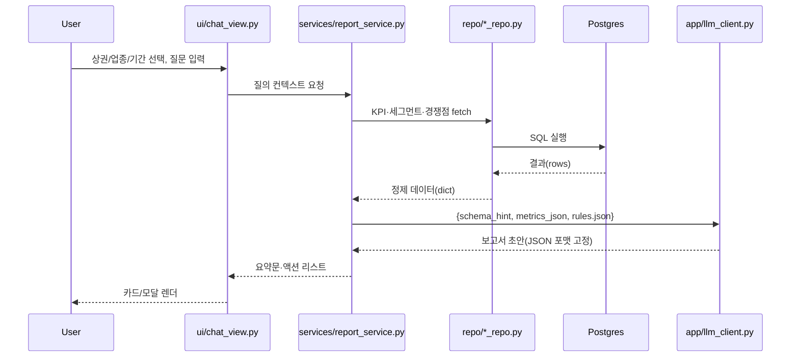

# AI Review & Sales Advisor

신한카드 데이터 기반 카페 매출·리뷰 인사이트.
Streamlit 단일 앱 + Supabase Postgres + Gemini 2.5 Flash.

---

## 1) 시스템 아키텍처



- DB는 Supabase. 로컬 DB 불필요.
- LLM은 DB 스키마를 근거로 한 JSON만 사용.
- 보고서는 화면 표시만. PDF 비활성.

---

## 2) 현재 폴더 구조

```text
app/
├─ repo/
│  ├─ compare_repo.py          # 경쟁점·상권 평균 쿼리
│  └─ metrics_repo.py          # 매출·방문·재방문 지표 쿼리
├─ services/
│  ├─ card_items_service.py    # KPI 카드·차트 데이터 조립
│  └─ report_service.py        # LLM 보고서용 JSON 빌드
├─ chat_core.py                # 코어 조립기(환경/DB/LLM 연결)
├─ deps.py                     # DB 세션 관리
└─ llm_client.py               # Gemini 호출 래퍼
configs/
├─ aspects.json                # 아스펙트 사전
└─ rules.json                  # 프롬프트 규칙
db/
├─ migrations/
└─ seed/
   ├─ ddl_001_create_raw_tables.sql
   └─ ddl_002_notes_views_indexes.sql
tests/
├─ test_analyzer.py
├─ test_db.py
└─ test_routers.py
ui/
├─ components/
│  └─ cards.py                 # 공통 카드 컴포넌트
├─ chat_view.py                # 챗 화면
├─ Dashboard.py                # 대시보드 화면
└─ marketing_report.py         # 보고서 화면(LLM 결과 렌더)
```

---

## 3) 챗봇 워크플로우

### 3.1 시퀀스(화면 → DB → LLM → 화면)



### 3.2 프롬프트 구성 규칙

- 입력: `metrics_json` + `schema_hint` + `configs/rules.json`.
- 출력 스키마 고정:

  ```json
  {
    "trend_2sent": "...",
    "segment_1sent": "...",
    "comp_1sent": "...",
    "actions": ["...", "...", "..."]
  }
  ```

- 금지: 외부 추정. 근거 없는 숫자.
- 안전장치: 숫자 파싱 실패 시 `NULLIF(regexp_replace(...))::numeric`.

### 3.3 핵심 함수 위치

- LLM 호출: `app/llm_client.py: generate_report(...)`
- 컨텍스트 조립: `app/services/report_service.py: build_report_payload(...)`
- 대화 핸들러: `ui/chat_view.py: render_chat(...)`

---

## 4) 데이터·지표 로직

- 원천: 성동구 카페 가맹점 개요·월별 이용·월별 고객.
- KPI: 매출, 방문, 재방문율, 객단가, 요일·시간대.
- 비교: 전주/전월, 업종(카페) 평균, 상권(성수/뚝섬).
- 예시 쿼리:

  ```sql
  -- 숫자 안전 캐스팅 + 음수 클램프
  SELECT
    to_date(ta_ym,'YYYYMM') AS month,
    NULLIF(regexp_replace(rc_m1_saa,'[^0-9.-]','','g'),'')::numeric AS sales,
    NULLIF(regexp_replace(rc_m1_to_ue_ct,'[^0-9.-]','','g'),'')::numeric AS visits,
    GREATEST(0, NULLIF(regexp_replace(revisit_rate,'[^0-9.-]','','g'),'')::numeric) AS revisit_rate
  FROM stg_merchant_monthly_usage
  WHERE encoded_mct = :m
  ORDER BY 1;
  ```

---

## 5) UI 구성

- 상단: 상권·업종 토글, KPI 카드 3종(가로 정렬).
- 중단: 월/주 추이, 요일·시간대 히트맵.
- 하단: 경쟁점 비교, 카드뉴스, LLM 보고서 카드.
- 제외: 업종 백분위, 업종대비 건수지수, 배달 비중.
- 스타일: 동일 높이 카드, 작은 폰트, 다크 모드.

---

## 6) 실행

```bash
py -3.12 -m venv .venv
# Windows: .\.venv\Scripts\activate
# macOS/Linux: source .venv/bin/activate
pip install -r requirements.txt
streamlit run ui/Dashboard.py
```

필수 환경변수:
`DATABASE_URL`, `GEMINI_API_KEY`,
`DEMO_MCT_SS_CAFE`, `DEMO_MCT_TTUK_CAFE`, `DEMO_MCT_SS_ISAKAYA`, `DEMO_MCT_TTUK_ISAKAYA`.

---

## 7) 데모 시나리오

- 상권×업종 4케이스 고정. ENCODED_MCT로 매핑.
- 선택 즉시 해당 MCT의 월별 KPI·세그·경쟁 평균 로드.
- 보고서는 화면 카드에만 표시.

---

## 8) 테스트 포인트

- `tests/test_db.py`: 연결·스키마 유효성.
- `tests/test_analyzer.py`: 숫자 파싱·음수 클램프.
- `tests/test_routers.py`: 보고서 출력 스키마 검증.

---

## 9) 향후 계획

| 영역            | 내용                                 | 목적   |
| --------------- | ------------------------------------ | ------ |
| 데이터 자동화   | ETL 스케줄러, 중복 제거, 실패 재시도 | 최신성 |
| 리뷰 파이프라인 | 정규화·중복 제거·언어 감지·아스펙트  | 품질   |
| LLM 비용 최적화 | 캐시, 샘플링 축소, 요약 저장         | 비용   |
| 추천            | 업종 벤치마크 기반 액션              | 자동화 |
| LangGraph       | DB→요약→액션 체인 명시화             | 재현성 |
| 권한            | RLS·가맹점 단위 접근                 | 보안   |
| 실험            | A/B 카드 레이아웃·리텐션 모듈        | 성과   |

---

---

## 10) 참고

- 데이터 출처: 신한카드 요식업종 성동구.
- 분석 초점: 카페(성수·뚝섬) 중심.
